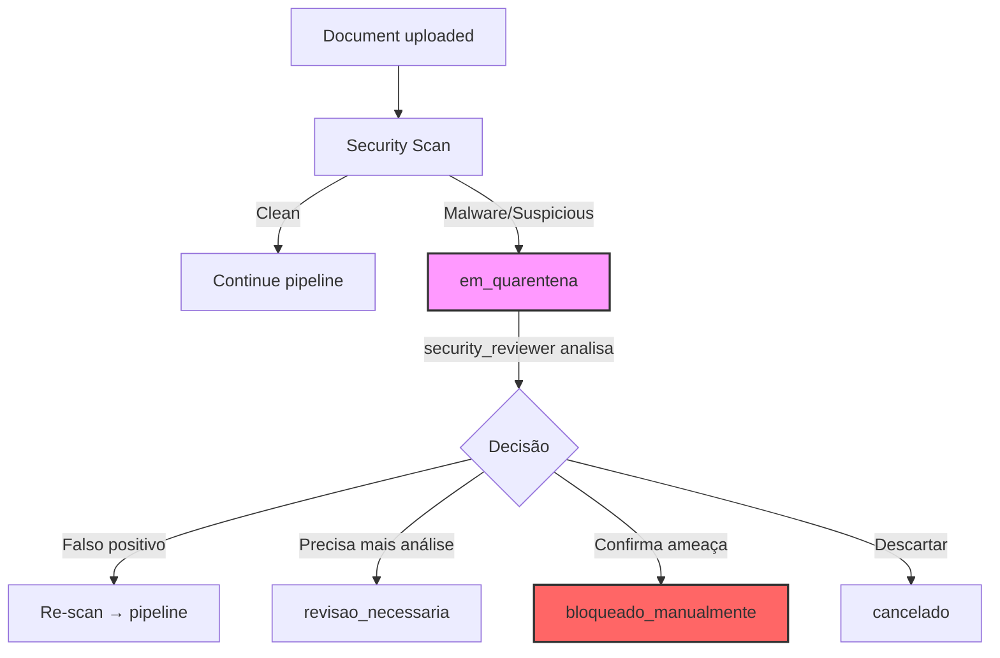

# MKIS — Blocker #5 Resolution: Pipeline State Machines

**Date:** 2026-07-22
**Status:** ✅ RESOLVED
**ARB Blocker #5:** Pipeline states incomplete (quarantined, awaiting_approval, needs_human_review) → **RESOLVED**
**Language:** Portuguese (aligned with Blocker #2 decision)
**DB Implementation:** TEXT + CHECK constraint (not PostgreSQL ENUM)
**Documents affected:** `05-pipelines.md`, `03-domain-model.md`, `04-database.md`, `11-api-contracts.md`, `12-events.md`

---

## 1. Design Decisions

| Decision | Choice | Rationale |
|----------|--------|-----------|
| **Quarantine** | **Global state** — any stage can transition to `em_quarentena` | Simplifies state machine; quarantine is generic (malware, policy, integrity) |
| **Human review** | **Generic state** — `revisao_necessaria` replaces stage-specific variants | User chose generic; any stage can flag need for human eyes |
| **Rejection destination** | Returns to **`rascunho`** — pipeline artifacts preserved | Correct and resubmit; no re-upload needed |
| **Node initial state** | **`rascunho`** when IngestionJob completes | Conservative: pipeline completes, node is draft until reviewed |
| **Approval location** | **KnowledgeNode only** | IngestionJob completes at node creation; `aguardando_aprovacao` is a KnowledgeNode state |

---

## 2. Two Separate State Machines

The pipeline has **two separate state machines** that interact at the boundary:

```
                    ┌──────────────────────────────┐
                    │     IngestionJob States       │
                    │  (document processing)        │
                    │                               │
                    │  na_fila → ... → concluido    │
                    │                         │     │
                    └─────────────────────────┼─────┘
                                              │
                                              ▼
                    ┌──────────────────────────────┐
                    │    KnowledgeNode States       │
                    │  (content lifecycle)          │
                    │                               │
                    │  rascunho → ... → aprovado    │
                    │              ou rejeitado     │
                    └──────────────────────────────┘
```

**Rule:** The IngestionJob generates a KnowledgeNode when it reaches `criando_no`. The KnowledgeNode is born at `rascunho`. They are independent after creation.

---

## 3. IngestionJob State Machine

### 3.1 Complete State List

| # | State | Display Label | Description | Terminal? |
|---|-------|--------------|-------------|-----------|
| 1 | `na_fila` | Na Fila | Job criado, aguardando worker | ❌ |
| 2 | `baixando` | Baixando | Baixando documento fonte | ❌ |
| 3 | `validacao_falhou` | Validação Falhou | Validação de formato/tamanho/integridade falhou | ❌ |
| 4 | `escanando` | Escanando | Scan de segurança em andamento (antivírus) | ❌ |
| 5 | `scan_falhou` | Scan Falhou | Scan de segurança falhou (erro técnico, não infecção) | ❌ |
| 6 | `em_quarentena` | Em Quarentena | Documento suspeito — isolado para análise forense | ❌ |
| 7 | `ocr_na_fila` | OCR na Fila | OCR aguardando worker | ❌ |
| 8 | `ocr_rodando` | OCR Rodando | OCR em andamento | ❌ |
| 9 | `ocr_falhou` | OCR Falhou | OCR falhou (técnico ou qualidade insuficiente) | ❌ |
| 10 | `parse_na_fila` | Parse na Fila | Parsing de documento na fila | ❌ |
| 11 | `parse_rodando` | Parse Rodando | Parsing em andamento | ❌ |
| 12 | `parse_falhou` | Parse Falhou | Parsing falhou | ❌ |
| 13 | `chunk_na_fila` | Chunk na Fila | Chunking de texto na fila | ❌ |
| 14 | `chunk_rodando` | Chunk Rodando | Chunking em andamento | ❌ |
| 15 | `chunk_falhou` | Chunk Falhou | Chunking falhou | ❌ |
| 16 | `embedding_na_fila` | Embedding na Fila | Geração de embedding na fila | ❌ |
| 17 | `embedding_rodando` | Embedding Rodando | Geração de embedding em andamento | ❌ |
| 18 | `embedding_falhou` | Embedding Falhou | Geração de embedding falhou | ❌ |
| 19 | `indexacao_na_fila` | Indexação na Fila | Indexação vetorial na fila | ❌ |
| 20 | `indexacao_rodando` | Indexação Rodando | Indexação em andamento | ❌ |
| 21 | `indexacao_falhou` | Indexação Falhou | Indexação falhou | ❌ |
| 22 | `criando_no` | Criando Nó | Criando KnowledgeNode a partir dos resultados do pipeline | ❌ |
| 23 | `criacao_falhou` | Criação Falhou | Criação do KnowledgeNode falhou | ❌ |
| 24 | `revisao_necessaria` | Revisão Necessária | Aguardando revisão humana (OCR baixa confiança, parsing ambíguo, segurança) | ❌ |
| 25 | `concluido` | Concluído | Pipeline concluído com sucesso — KnowledgeNode criado em `rascunho` | ✅ |
| 26 | `falhou` | Falhou | Falha terminal após exaustão de retries | ✅ |
| 27 | `bloqueado_manualmente` | Bloqueado Manualmente | Bloqueado por operador (data_steward) | ✅ |
| 28 | `cancelado` | Cancelado | Cancelado manualmente | ✅ |

### 3.2 Key Changes from Previous Version

| Change | Old (05-pipelines.md) | New | Reason |
|--------|----------------------|-----|--------|
| **Quarantine** | `scan_quarantined` (stage-specific) | `em_quarentena` (global) | ARB §5.2 + user decision: generic quarantine |
| **Human review** | `ocr_needs_human_review` (OCR only) | `revisao_necessaria` (generic) | ARB §5.2 + user decision: any stage can flag |
| **Approval removed** | `aguardando_aprovacao`, `aprovado_para_indice` | ❌ Removed from IngestionJob | User decision: approval lives on KnowledgeNode |
| **Node creation** | Implicit (no stage) | `criando_no`, `criacao_falhou` | Explicit boundary between pipeline and content |
| **Terminal failed** | `failed` (generic) | `falhou` + precise stage failures | All stages have their own failure state |
| **Language** | English (e.g. `queued`) | Portuguese (e.g. `na_fila`) | Aligned with Blocker #2 decision |

### 3.3 Valid Transitions (Complete)

```
na_fila → baixando

baixando → escanando
baixando → validacao_falhou                      (formato/tamanho inválido)

escanando → ocr_na_fila                          (scan limpo, PDF precisa OCR)
escanando → parse_na_fila                        (scan limpo, já é texto)
escanando → em_quarentena                        (malware/suspeito detectado)
escanando → scan_falhou                          (erro técnico no scan)

ocr_na_fila → ocr_rodando
ocr_rodando → parse_na_fila                      (OCR concluído com sucesso)
ocr_rodando → revisao_necessaria                 (OCR com baixa confiança)
ocr_rodando → ocr_falhou                         (OCR falhou tecnicamente)

parse_na_fila → parse_rodando
parse_rodando → chunk_na_fila                    (parse concluído)
parse_rodando → revisao_necessaria               (parse ambíguo, prompt injection suspeito)
parse_rodando → parse_falhou                     (parse falhou)

chunk_na_fila → chunk_rodando
chunk_rodando → embedding_na_fila                (chunking concluído)
chunk_rodando → chunk_falhou                     (chunking falhou)

embedding_na_fila → embedding_rodando
embedding_rodando → indexacao_na_fila            (embedding gerado)
embedding_rodando → embedding_falhou             (embedding falhou)

indexacao_na_fila → indexacao_rodando
indexacao_rodando → criando_no                   (indexação concluída)
indexacao_rodando → indexacao_falhou             (indexação falhou)

criando_no → concluido                           (KnowledgeNode criado em rascunho)
criando_no → criacao_falhou                      (falha na criação)

--- From quarantine / review ---
revisao_necessaria → baixando                    (revisor aprova, reprocessa)
revisao_necessaria → ocr_rodando                 (revisor solicita re-OCR manual)
revisao_necessaria → parse_rodando               (revisor aprova o parse)
revisao_necessaria → em_quarentena               (revisor acha suspeito, eleva para quarentena)
revisao_necessaria → cancelado                   (revisor cancela o job)

em_quarentena → revisao_necessaria               (security_reviewer solicita análise adicional)
em_quarentena → escanando                        (security_reviewer aprova, re-scan)
em_quarentena → cancelado                        (security_reviewer cancela)
em_quarentena → bloqueado_manualmente            (security_reviewer bloqueia definitivamente)

--- Terminal transitions ---
validacao_falhou → na_fila                       (retry com novo attempt_id)
validacao_falhou → cancelado                     (operador desiste)
scan_falhou → escanando                          (retry)
scan_falhou → cancelado
ocr_falhou → ocr_na_fila                         (retry)
ocr_falhou → cancelado
parse_falhou → parse_na_fila                     (retry)
parse_falhou → cancelado
chunk_falhou → chunk_na_fila                     (retry)
chunk_falhou → cancelado
embedding_falhou → embedding_na_fila             (retry)
embedding_falhou → cancelado
indexacao_falhou → indexacao_na_fila             (retry)
indexacao_falhou → cancelado
criacao_falhou → criando_no                      (retry)
criacao_falhou → cancelado

--- Global allowed from any state ---
qualquer_estado_nao_terminal → em_quarentena     (gatilho: policy, data_steward)
qualquer_estado_nao_terminal → cancelado         (gatilho: operador manual)
qualquer_estado_nao_terminal → bloqueado_manualmente (gatilho: data_steward)

--- States that CANNOT transition ---
concluido → (nenhum — terminal)
falhou → na_fila                                  (apenas se novo attempt_id gerado)
bloqueado_manualmente → (nenhum — terminal)
cancelado → (nenhum — terminal)
```

### 3.4 Retry Policy

| Stage | Max Attempts | Backoff | Reset Condition |
|-------|-------------|---------|-----------------|
| `baixando` | 3 | 30s, 2min, 5min | New attempt_id |
| `escanando` | 3 | 10s, 30s, 1min | New attempt_id |
| `ocr_*` | 3 | 1min, 5min, 15min | New attempt_id |
| `parse_*` | 3 | 1min, 5min, 15min | New attempt_id |
| `chunk_*` | 3 | 10s, 30s, 1min | New attempt_id |
| `embedding_*` | 3 | 30s, 2min, 5min | New attempt_id |
| `indexacao_*` | 3 | 10s, 30s, 1min | New attempt_id |
| `criando_no` | 3 | 5s, 15s, 30s | New attempt_id |

After 3 consecutive failures in any stage → job goes to `falhou` (terminal).

### 3.5 Recovering from falhou

- Job in `falhou` can be **re-queued** by a `data_steward` with a **new** `attempt_id`
- Old job history is preserved in `audit_trail` for forensics
- DLQ stores jobs with 3+ failures; DLQ items require manual action to re-queue

### 3.6 Quarantine Workflow



**Retention:** Documents in `em_quarentena` are retained for **90 days** for forensic analysis, then auto-purged.

---

## 4. KnowledgeNode State Machine

### 4.1 Complete State List

Updated from Blocker #2 with the addition of `aguardando_aprovacao`.

| # | State | Display Label | Description | Terminal? |
|---|-------|--------------|-------------|-----------|
| 1 | `rascunho` | Rascunho | Em edição, não publicado. Embedding pode ser NULL. | ❌ |
| 2 | `em_revisao` | Em Revisão | Passando por revisão clínica por clinical_validator | ❌ |
| 3 | `aguardando_aprovacao` | Aguardando Aprovação | Revisão concluída, aguardando aprovação final do clinical_validator sênior | ❌ |
| 4 | `aprovado` | Aprovado | Publicado, indexado, disponível para busca. Embedding obrigatório. | ❌ |
| 5 | `rejeitado` | Rejeitado | Rejeitado na revisão. Pode retornar a `rascunho` com notas. | ❌ |
| 6 | `descontinuado` | Descontinuado | Não é mais recomendado, mas permanece no índice histórico | ✅ |
| 7 | `substituido` | Substituído | Substituído por versão mais nova. Referência `superseded_by`. | ✅ |

### 4.2 Changes from Blocker #2

| Change | Blocker #2 | New | Reason |
|--------|-----------|-----|--------|
| **New state** | (absent) | `aguardando_aprovacao` | ARB §5.2 + user decision: separation between review and final approval |

### 4.3 Valid Transitions

```
rascunho → em_revisao                             (enviado para revisão clínica)

em_revisao → aguardando_aprovacao                 (revisor concluiu análise, recomenda aprovação)
em_revisao → rejeitado                            (revisor rejeita)

aguardando_aprovacao → aprovado                   (clinical_validator sênior aprova)
aguardando_aprovacao → rejeitado                  (clinical_validator sênior rejeita)

aprovado → descontinuado                          (deprecado — editor)
aprovado → substituido                            (substituído por superseded_by)

rejeitado → rascunho                              (pode ser corrigido e reenviado — novo attempt)

descontinuado → (terminal — nenhuma)
substituido → (terminal — nenhuma)
```

### 4.4 Invariants

| State | Requires | Forbids |
|-------|---------|---------|
| `rascunho` | — | embedding NOT NULL |
| `em_revisao` | assigned_reviewer NOT NULL | auto-approve |
| `aguardando_aprovacao` | review_notes NOT NULL, reviewed_by NOT NULL | auto-approve |
| `aprovado` | approved_by NOT NULL, approved_at NOT NULL, evidence_level NOT NULL, embedding NOT NULL | — |
| `rejeitado` | rejection_reason NOT NULL (min 20 chars), rejected_by NOT NULL | — |
| `descontinuado` | deprecation_reason NOT NULL, deprecated_by NOT NULL | — |
| `substituido` | superseded_by NOT NULL (UUID), superseded_reason NOT NULL | — |

### 4.5 Integration: IngestionJob → KnowledgeNode

When IngestionJob reaches `criando_no`:

```sql
-- Simplified pseudocode
BEGIN;
    -- Create KnowledgeNode with results from pipeline
    INSERT INTO knowledge_nodes (id, title, summary, content, knowledge_type, ...,
                                 status, embedding, checksum, created_by)
    VALUES (gen_random_uuid(), ..., 'rascunho', ..., ...);
    
    -- Create KnowledgeArtifact record
    INSERT INTO knowledge_artifacts (...) VALUES (...);
    
    -- Update IngestionJob to concluido
    UPDATE ingestion_jobs SET status = 'concluido', completed_at = NOW()
    WHERE id = :job_id;
    
    -- Emit events
    INSERT INTO outbox (event_type, payload, ...)
    VALUES ('KnowledgeNodeCreated', jsonb_build_object(...), ...);
    
    INSERT INTO outbox (event_type, payload, ...)
    VALUES ('IngestionJobCompleted', jsonb_build_object(...), ...);
COMMIT;
```

### 4.6 Timeout Rules

| State | Timeout | Action |
|-------|---------|--------|
| `em_revisao` | 30 dias sem transição | Alerta para `clinical_validator` + escalada para `data_steward` |
| `aguardando_aprovacao` | 15 dias sem transição | Alerta para `clinical_validator` sênior |
| `revisao_necessaria` (no IngestionJob) | 7 dias sem ação | Job vai para `cancelado` automaticamente |
| `em_quarentena` (no IngestionJob) | 90 dias sem ação | Purge automático com certificado |

**Nunca auto-aprovar.** Timeout gera alerta, nunca transição automática para `aprovado`.

---

## 5. Conditional Transitions (Guards)

Some transitions require preconditions to be met. These are enforced by the application layer:

| From | To | Guard Condition |
|------|----|-----------------|
| `criando_no` | `concluido` | KnowledgeNode INSERT succeeded |
| `chunk_na_fila` | `chunk_rodando` | `parsed_text` IS NOT NULL and length > 0 |
| `embedding_na_fila` | `embedding_rodando` | At least 1 chunk exists for this job |
| `rascunho` | `em_revisao` | `knowledge_type` IS NOT NULL, `evidence_level` IS NOT NULL, `category` IS NOT NULL |
| `aguardando_aprovacao` | `aprovado` | `embedding` IS NOT NULL, `scientific_score` IS NOT NULL |
| `rejeitado` | `rascunho` | New `attempt_id` generated, old job history preserved |

### 5.1 Impossible Transitions (Explicitly Forbidden)

These were identified by the ARB as possible in the previous spec. They are now **explicitly impossible**:

| Transition | Why Impossible |
|-----------|---------------|
| `validacao_falhou → chunk_na_fila` | Validation failed → no valid document to process |
| `scan_falhou → ocr_na_fila` | Scan failed → security posture unknown |
| `parsing_falhou → chunk_na_fila` | Parsing failed → no `parsed_text` to chunk |
| `ocr_falhou → indexacao_na_fila` | OCR failed → no text to index |
| `embedding_falhou → concluido` | Embedding failed → node without vector |
| `falhou → concluido` | Terminal failure cannot become terminal success |

---

## 6. Actor Permissions per Transition

| Actor | Can do | Cannot do |
|-------|--------|-----------|
| **system** (worker) | All automatic stage transitions (`na_fila → baixando`, `ocr_rodando → parse_na_fila`, etc.) | Human decisions (approve, reject, quarantine resolution) |
| **clinical_validator** | `rascunho → em_revisao`, `em_revisao → aguardando_aprovacao`, `em_revisao → rejeitado`, `rejeitado → rascunho` | `aguardando_aprovacao → aprovado` (only senior) |
| **clinical_validator_senior** | `aguardando_aprovacao → aprovado`, `aprovado → descontinuado`, `aprovado → substituido` | Cancel job |
| **security_reviewer** | `em_quarentena → escanando`, `em_quarentena → revisao_necessaria`, `em_quarentena → bloqueado_manualmente` | Approve KnowledgeNode |
| **data_steward** | `bloqueado_manualmente → na_fila`, `falhou → na_fila` (new attempt_id), `cancelado → na_fila` | Approve KnowledgeNode |

---

## 7. State Machine Diagram

```
┌─────────────────────────────────────────────────────────────────────────────┐
│                         INGESTION JOB                                        │
│                                                                              │
│   na_fila → baixando → escanando ──────────────────────────────────────┐   │
│                              │                                          │   │
│                    ┌─────────┼──────────┐                                │   │
│                    ▼         ▼          ▼                                │   │
│             parse_na_fila  ocr_na_fila  em_quarentena                   │   │
│                    │         │              │                            │   │
│                    ▼         ▼              ▼                            │   │
│             parse_rodando  ocr_rodando   revisao_necessaria             │   │
│                    │         │              │                            │   │
│                    ▼         ▼              ▼                            │   │
│             chunk_na_fila ← parse ok    escanando (re-try)             │   │
│                    │                                                    │   │
│                    ▼                                                    │   │
│             chunk_rodando                                               │   │
│                    │                                                    │   │
│                    ▼                                                    │   │
│             embedding_na_fila                                           │   │
│                    │                                                    │   │
│                    ▼                                                    │   │
│             embedding_rodando                                          │   │
│                    │                                                    │   │
│                    ▼                                                    │   │
│             indexacao_na_fila                                           │   │
│                    │                                                    │   │
│                    ▼                                                    │   │
│             indexacao_rodando → criando_no → concluido                 │   │
│                                               │                        │   │
│                     Qualquer estado ──────→ em_quarentena              │   │
│                     Qualquer estado ──────→ cancelado                  │   │
│                     Qualquer estado ──────→ bloqueado_manualmente      │   │
│                                                                         │   │
│      Stage failures → {stage}_falhou → (retry até 3×) → falhou        │   │
└─────────────────────────────────────────────────────│──────────────────────┘
                                                       │
                                                       ▼
┌─────────────────────────────────────────────────────────────────────────────┐
│                       KNOWLEDGE NODE                                        │
│                                                                             │
│   rascunho ──→ em_revisao ──→ aguardando_aprovacao ──→ aprovado            │
│       ↑              │               │                    │   │             │
│       │              ▼               ▼                    │   │             │
│       └────── rejeitado              │                    │   │             │
│                                      │                    ▼   ▼             │
│                                      │           descontinuado              │
│                                      │           substituido                │
│                                      └──────────────────┘                  │
└─────────────────────────────────────────────────────────────────────────────┘
```

---

## 8. Events Associated

Updated from `12-events.md` to reflect new states:

| Event | Triggered By | Payload Highlights |
|-------|-------------|-------------------|
| `IngestionJobQueued` | System | `job_id`, `tenant_id`, `source_url` |
| `IngestionJobStatusChanged` | System | `job_id`, `from_state`, `to_state`, `attempt` |
| `IngestionJobFailed` | System | `job_id`, `stage`, `error_code`, `attempts` |
| `IngestionJobCompleted` | System | `job_id`, `node_id`, `duration_ms` |
| `QuarantineCreated` | System/scan | `job_id`, `reason` (malware/policy/content), `sha256` |
| `QuarantineResolved` | Security reviewer | `job_id`, `resolution` (reprocess/block/cancel), `reviewer_id` |
| `HumanReviewRequested` | System | `job_id`, `stage`, `reason` (low_confidence/suspicious/ambiguous) |
| `HumanReviewCompleted` | Security/clinical reviewer | `job_id`, `resolution`, `reviewer_id` |
| `KnowledgeNodeCreated` | System (from pipeline) | `node_id`, `tenant_id`, `knowledge_type`, `checksum` |
| `KnowledgeNodeSubmitted` | Clinical validator | `node_id`, `from_state=rascunho`, `to_state=em_revisao` |
| `KnowledgeNodeAwaitingApproval` | Clinical validator | `node_id`, `reviewed_by`, `review_notes` |
| `KnowledgeNodeApproved` | Senior clinical validator | `node_id`, `approved_by`, `approved_at` |
| `KnowledgeNodeRejected` | Clinical validator | `node_id`, `rejected_by`, `rejection_reason` |
| `KnowledgeNodeDeprecated` | Editor | `node_id`, `deprecated_by`, `deprecation_reason` |
| `KnowledgeNodeSuperseded` | Editor | `node_id`, `superseded_by`, `superseded_reason` |
| `EmbeddingGenerated` | System | `node_id`, `embedding_version`, `dimensions` |
| `GraphEdgeCreated` | System/validator | `edge_id`, `subject_id`, `predicate`, `object_id` |
| `EvidenceScoreUpdated` | System (LLM) | `node_id`, `evidence_level`, `scientific_score`, `bias_risk` |
| `HardDeleteRequested` | Data steward | `node_id`, `tenant_id`, `legal_hold_check` |
| `HardDeleteCompleted` | System | `node_id`, `purge_certificate_id` |

---

## 9. DB Schema: ingestion_jobs Table

```sql
CREATE TABLE ingestion_jobs (
    id UUID PRIMARY KEY DEFAULT gen_random_uuid(),
    tenant_id UUID NOT NULL,
    artifact_id UUID REFERENCES knowledge_artifacts(id),
    node_id UUID REFERENCES knowledge_nodes(id),  -- populated after criando_no succeeds
    
    -- Canonical state machine (TEXT + CHECK)
    status TEXT NOT NULL DEFAULT 'na_fila' CHECK (status IN (
        'na_fila', 'baixando', 'validacao_falhou', 'escanando', 'scan_falhou',
        'em_quarentena',
        'ocr_na_fila', 'ocr_rodando', 'ocr_falhou',
        'parse_na_fila', 'parse_rodando', 'parse_falhou',
        'chunk_na_fila', 'chunk_rodando', 'chunk_falhou',
        'embedding_na_fila', 'embedding_rodando', 'embedding_falhou',
        'indexacao_na_fila', 'indexacao_rodando', 'indexacao_falhou',
        'criando_no', 'criacao_falhou',
        'revisao_necessaria',
        'concluido', 'falhou', 'bloqueado_manualmente', 'cancelado'
    )),
    
    attempt_id UUID NOT NULL DEFAULT gen_random_uuid(),
    attempt_count INT NOT NULL DEFAULT 1,
    max_attempts INT NOT NULL DEFAULT 3,
    
    current_stage TEXT,               -- name of current processing stage
    error_code TEXT,                   -- machine-readable error code
    error_message TEXT,                -- human-readable error description
    quarantine_reason TEXT,            -- reason if em_quarentena
    review_notes TEXT,                 -- notes from human reviewer
    
    source_url TEXT,
    source_package TEXT,
    priority INT NOT NULL DEFAULT 0,   -- higher = more urgent
    
    started_at TIMESTAMPTZ,
    completed_at TIMESTAMPTZ,
    created_at TIMESTAMPTZ NOT NULL DEFAULT NOW(),
    updated_at TIMESTAMPTZ NOT NULL DEFAULT NOW(),
    
    -- FK constraints
    CONSTRAINT valid_attempt CHECK (attempt_count <= max_attempts),
    CONSTRAINT terminal_state_check CHECK (
        (status IN ('concluido', 'falhou', 'bloqueado_manualmente', 'cancelado'))::int +
        (completed_at IS NOT NULL)::int
        NOT IN (1)  -- both or neither
    )
);

-- Indexes
CREATE INDEX idx_ingestion_jobs_tenant_status ON ingestion_jobs (tenant_id, status);
CREATE INDEX idx_ingestion_jobs_attempt ON ingestion_jobs (attempt_id) WHERE status IN ('na_fila', 'falhou');
CREATE INDEX idx_ingestion_jobs_quarantine ON ingestion_jobs (created_at) WHERE status = 'em_quarentena';
```

## 10. DB Schema: Update to knowledge_nodes CHECK

Update the `knowledge_nodes.status` CHECK constraint from Blocker #2 to include `aguardando_aprovacao`:

```sql
ALTER TABLE knowledge_nodes DROP CONSTRAINT IF EXISTS knowledge_nodes_status_check;
ALTER TABLE knowledge_nodes ADD CONSTRAINT knowledge_nodes_status_check
    CHECK (status IN (
        'rascunho', 'em_revisao', 'aguardando_aprovacao',
        'aprovado', 'rejeitado', 'descontinuado', 'substituido'
    ));
```

---

## 11. Rollback Plan

If the new state machine causes issues:

| Scenario | Rollback Action | Impact |
|----------|----------------|--------|
| Missing transition in IngestionJob | Insert new state into CHECK constraint (alter table is ~ms) | Zero downtime |
| Wrong transition logic | Revert application code; DB schema additive only | Zero downtime |
| `aguardando_aprovacao` causing confusion | Revert to Blocker #2 CHECK without it | Zero downtime (remove from constraint, existing rows with that state need manual migration) |
| IngestionJob not completing | Check `criando_no → concluido` transition; fall back to direct node creation bypassing pipeline | Degraded but functional |

**Principle:** All DB changes are additive-only. The CHECK constraints are enforced in application layer first; DB constraints are defense-in-depth. If a transition is wrong, fix the app code, not the schema.

---

## 12. Impact Summary

| Document | Change |
|----------|--------|
| `03-domain-model.md` | ✅ Add `aguardando_aprovacao` to KnowledgeNode states; update invariants for new state |
| `04-database.md` | ✅ Add `ingestion_jobs` table schema with CHECK; update `knowledge_nodes.status` CHECK |
| `05-pipelines.md` | ✅ **Rewrite** with complete state machines, transitions, guards, quarantine/review/approval workflows |
| `11-api-contracts.md` | ✅ Update any `/pipeline` or `/nodes` endpoints to reflect new states |
| `12-events.md` | ✅ Add `HumanReviewRequested`, `KnowledgeNodeSubmitted`, `KnowledgeNodeAwaitingApproval` events |
| `blocker-2-enums-canonical.md` | ✅ Reference this document for pipeline states; remove pipeline states from blocker-2 (keep only KnowledgeNode states there) |

---

## 13. Remaining Blockers

| # | Blocker | Status | Next Step |
|---|--------|--------|-----------|
| 1 | Vendor/Stack choice | ✅ **RESOLVED** | BGE-M3 + Qwen 2.5 7B |
| 2 | Canonical enums | ✅ **RESOLVED** | All 16 enums defined |
| 3 | pgvector migration | ✅ **RESOLVED** | Dual-write + shadow index |
| 4 | Partitioning | ✅ **RESOLVED** | Range by created_at + pg_partman |
| **5** | **Pipeline states** | **✅ RESOLVED** | **This document** |
| 6 | Deep delete LGPD | ❌ Open | Design cascade: vectors → KG → cache → audit |

---

*End of document — Blocker #5 resolved ✅*
